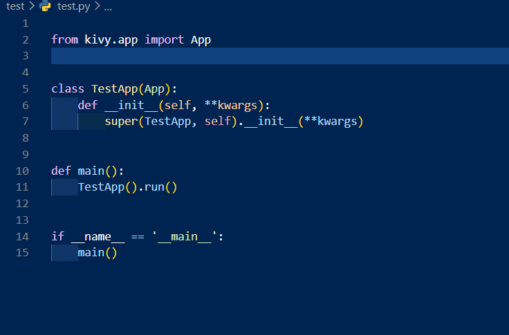

# pykv-snippets README

## Features

- You can use some snippets useful in python kivy description !
- Snippets supports some keywords in Kivy (e.g. sx -> size_hint_x:)
- All of snippets in python begin with "kv" so that you can discriminate between this snippets and others.

### Demo

This supports some widgets import.

Enjoy Kivy !

## From author

I'm new to python, kivy and github.
If you know more useful snippets, let me know them.

### 1.0.1

add some snippets of uix widgets

### 1.0.0

Initial release.

## License

MIT License, refer to license file.