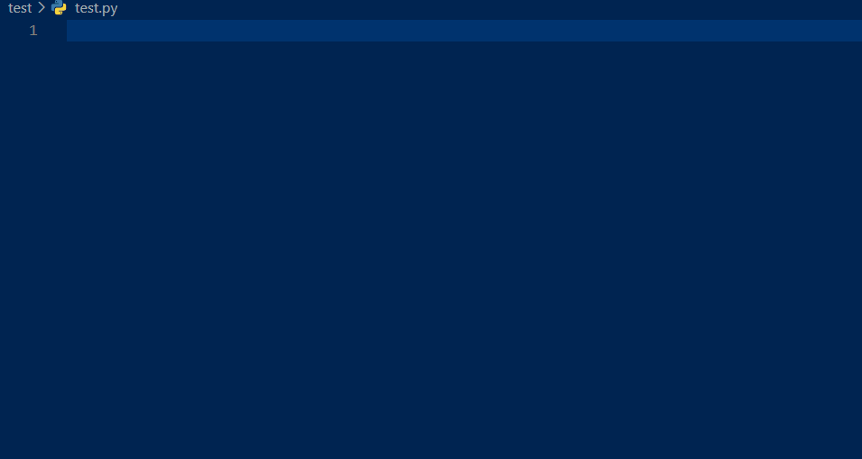
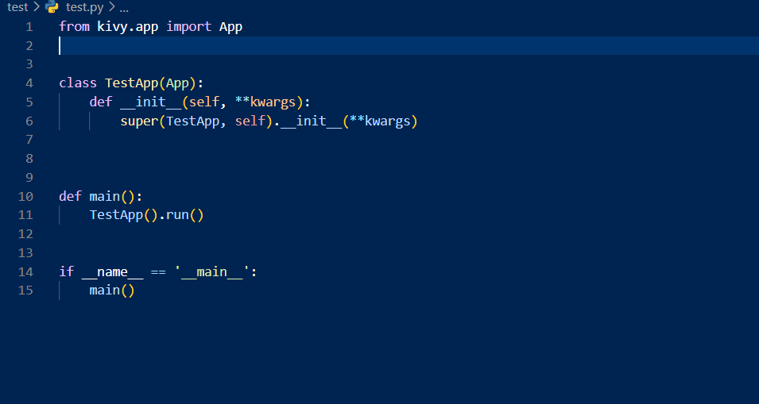
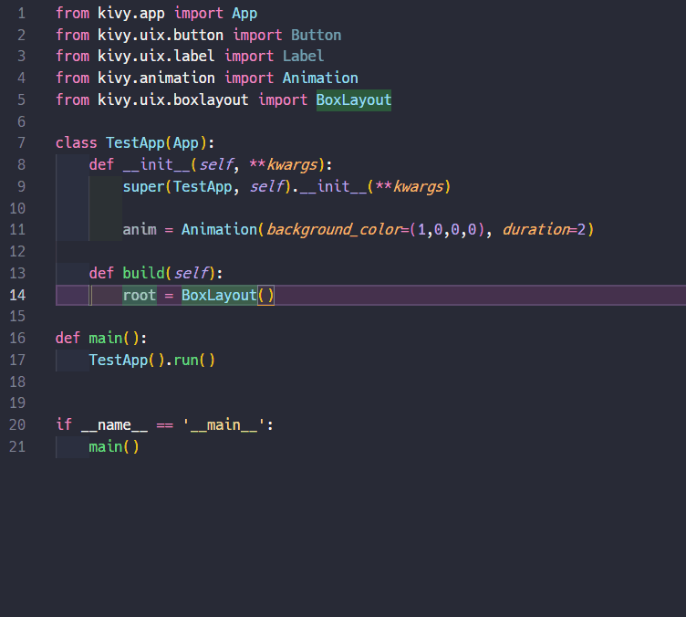

# pykv-snippets

## Features

- You can use some useful snippets when coding python Kivy!
- Snippets supports some keywords in Kivy (e.g. sx -> size_hint_x: )
- Most of snippets in python begin with "kv" so that you can discriminate between this snippets and others.
- The others in python are keyword arguments for Widget, Animation, bind.

## Demo

This extension supports some widgets import.
Basically, the snippets are kv(class name) like kvbutton, kvlabel.

In addition, supports some keyword arguments for Widget, bind, and so on!

Enjoy Kivy!

## CHANGELOG

See [CHANGELOG.md](https://github.com/Take-Me1010/pykv-snippets).

## License

MIT License, refer to license file.